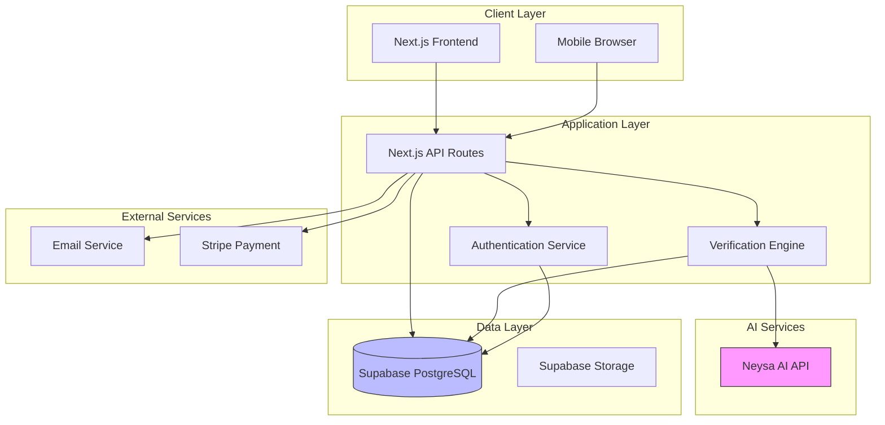
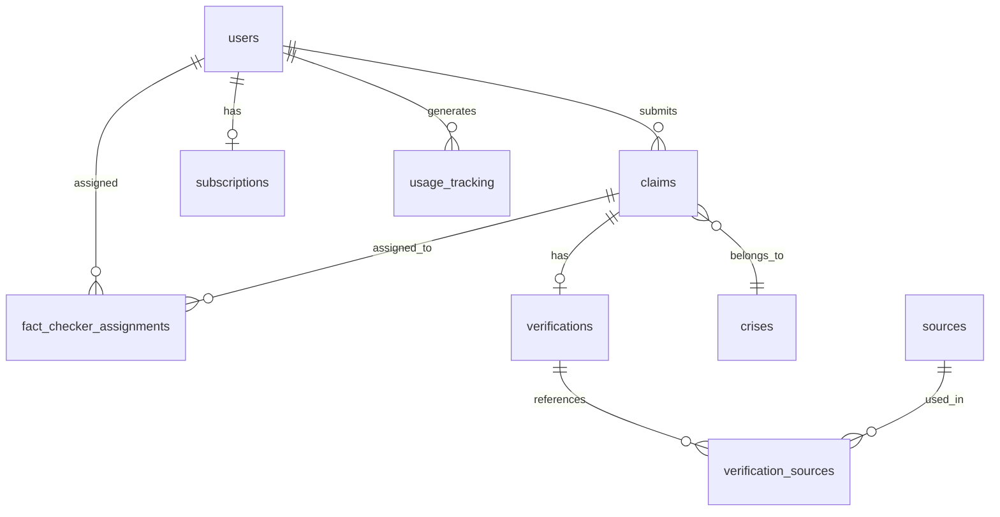

# Design Document: CrisisTruth Real-Time Crisis Verification Platform

## Overview

CrisisTruth is an AI-powered fact verification platform designed to combat misinformation during crisis situations. The system provides real-time claim verification using AI analysis, multi-source validation, and expert fact-checker review. The platform is built on a modern web stack using Next.js 14, React 18, Supabase for backend services, and Neysa AI for intelligent claim verification.

The architecture follows a serverless approach with Next.js API routes handling backend logic, Supabase providing database and authentication services, and a responsive React frontend delivering an intuitive user experience. The system supports multiple user roles (users, fact-checkers, administrators), subscription tiers (free, pro, enterprise), and real-time updates for crisis monitoring.

## Architecture

### High-Level Architecture



### Technology Stack

**Frontend:**
- Next.js 14 (App Router)
- React 18
- TypeScript
- Tailwind CSS 4
- Radix UI components
- React Hook Form + Zod validation
- Next Themes for dark mode

**Backend:**
- Next.js API Routes (serverless)
- Supabase (PostgreSQL database, authentication, real-time subscriptions)
- Neysa AI API for claim verification

**Infrastructure:**
- Vercel (hosting and deployment)
- Supabase Cloud (database and auth)
- Environment-based configuration

### Design Rationale

1. **Serverless Architecture**: Next.js API routes provide a scalable, cost-effective backend without managing servers
2. **Supabase Integration**: Provides authentication, database, and real-time capabilities in a unified platform
3. **AI-First Verification**: Neysa AI enables intelligent claim analysis with natural language understanding
4. **Component-Based UI**: Radix UI provides accessible, customizable components for rapid development
5. **Type Safety**: TypeScript ensures code reliability and better developer experience

## Components and Interfaces

### Core Components

#### 1. Authentication Service

**Purpose**: Manage user registration, login, session management, and authorization

**Interface**:
```typescript
interface AuthService {
  register(email: string, password: string, name: string): Promise<User>
  login(email: string, password: string): Promise<Session>
  logout(): Promise<void>
  resetPassword(email: string): Promise<void>
  getCurrentUser(): Promise<User | null>
  verifySession(token: string): Promise<boolean>
}

interface User {
  id: string
  email: string
  name: string
  role: 'user' | 'fact-checker' | 'admin'
  subscription_tier: 'free' | 'pro' | 'enterprise'
  created_at: string
  updated_at: string
}
```

**Implementation Notes**:
- Uses Supabase Auth for secure authentication
- Implements Row Level Security (RLS) policies
- Session tokens stored in HTTP-only cookies
- Password reset via email with secure tokens

#### 2. Claim Verification Engine


**Purpose**: Process claims through AI analysis and generate verification results

**Interface**:
```typescript
interface VerificationEngine {
  verifyClaim(claimText: string): Promise<VerificationResult>
  verifyClaimWithImage(claimText: string, imageUrl: string): Promise<VerificationResult>
  extractKeyAssertions(claimText: string): Promise<string[]>
  queryTrustedSources(assertions: string[]): Promise<SourceResult[]>
  calculateConfidenceScore(sources: SourceResult[]): number
}

interface VerificationResult {
  status: 'verified' | 'disputed' | 'unverified'
  confidenceScore: number
  summary: string
  sources: Source[]
  evidence: {
    supporting: number
    contradicting: number
    neutral: number
  }
  processingTime: number
}

interface Source {
  title: string
  url: string
  credibility: number
  excerpt: string
  type: 'scientific' | 'news' | 'government' | 'fact-check' | 'academic'
}
```

**Implementation Notes**:
- Integrates with Neysa AI API for natural language processing
- Implements fallback mock verification for development/testing
- Stores verification results in database for historical tracking
- Calculates confidence scores based on source credibility and consensus

#### 3. Crisis Management System


**Purpose**: Manage crisis events and aggregate related claims

**Interface**:
```typescript
interface CrisisManager {
  createCrisis(data: CreateCrisisInput): Promise<Crisis>
  updateCrisis(id: string, data: UpdateCrisisInput): Promise<Crisis>
  getCrisis(id: string): Promise<Crisis>
  listCrises(filters: CrisisFilters): Promise<Crisis[]>
  associateClaimWithCrisis(claimId: string, crisisId: string): Promise<void>
  getCrisisStatistics(crisisId: string): Promise<CrisisStats>
}

interface Crisis {
  id: string
  title: string
  description: string
  location: string
  priority: 'low' | 'medium' | 'high'
  status: 'active' | 'resolved' | 'monitoring'
  created_at: string
  updated_at: string
}

interface CrisisStats {
  totalClaims: number
  verifiedCount: number
  disputedCount: number
  unverifiedCount: number
  averageConfidence: number
}
```

#### 4. Fact-Checker Assignment System


**Purpose**: Assign claims to expert fact-checkers for human review

**Interface**:
```typescript
interface FactCheckerService {
  assignClaim(claimId: string, factCheckerId: string): Promise<Assignment>
  submitReview(assignmentId: string, review: ReviewData): Promise<void>
  getFactCheckerWorkload(factCheckerId: string): Promise<Assignment[]>
  getFactCheckerMetrics(factCheckerId: string): Promise<FactCheckerMetrics>
}

interface Assignment {
  id: string
  claim_id: string
  fact_checker_id: string
  assigned_at: string
  completed_at: string | null
  review_notes: string | null
}

interface FactCheckerMetrics {
  verifications_count: number
  accuracy_rate: number
  average_review_time: number
}
```

#### 5. Subscription Management


**Purpose**: Handle subscription tiers and feature access control

**Interface**:
```typescript
interface SubscriptionService {
  createSubscription(userId: string, tier: SubscriptionTier): Promise<Subscription>
  updateSubscription(userId: string, tier: SubscriptionTier): Promise<Subscription>
  cancelSubscription(userId: string): Promise<void>
  checkFeatureAccess(userId: string, feature: string): Promise<boolean>
  trackUsage(userId: string, action: string): Promise<void>
  enforceUsageLimits(userId: string): Promise<UsageLimitResult>
}

interface Subscription {
  id: string
  user_id: string
  tier: 'free' | 'pro' | 'enterprise'
  status: 'active' | 'cancelled' | 'expired'
  current_period_start: string
  current_period_end: string
}

interface UsageLimitResult {
  allowed: boolean
  remaining: number
  limit: number
  resetDate: string
}
```

**Tier Limits**:
- Free: 10 verifications/month, basic features
- Pro: 100 verifications/month, priority processing, advanced analytics
- Enterprise: Unlimited verifications, API access, custom integrations

## Data Models


### Database Schema

The system uses PostgreSQL via Supabase with the following core tables:

**users**: User accounts and profiles
- id (UUID, PK)
- email (VARCHAR, UNIQUE)
- name (VARCHAR)
- role (ENUM: user, fact-checker, admin)
- subscription_tier (ENUM: free, pro, enterprise)
- created_at, updated_at (TIMESTAMP)

**claims**: User-submitted claims for verification
- id (UUID, PK)
- text (TEXT)
- user_id (UUID, FK → users)
- status (ENUM: pending, processing, verified, disputed, unverified, in-review)
- category (VARCHAR)
- crisis_id (UUID, FK → crises)
- created_at, updated_at (TIMESTAMP)

**verifications**: AI-generated verification results
- id (UUID, PK)
- claim_id (UUID, FK → claims, UNIQUE)
- status (ENUM: verified, disputed, unverified)
- confidence_score (INTEGER, 0-100)
- summary (TEXT)
- processing_time_ms (INTEGER)
- created_at (TIMESTAMP)

**sources**: Trusted information sources
- id (UUID, PK)
- title (VARCHAR)
- url (TEXT)
- type (ENUM: scientific, news, government, fact-check, academic)
- credibility (INTEGER, 0-100)
- is_active (BOOLEAN)
- api_endpoint (TEXT)
- created_at (TIMESTAMP)

**crises**: Crisis events for claim aggregation
- id (UUID, PK)
- title (VARCHAR)
- description (TEXT)
- location (VARCHAR)
- priority (ENUM: low, medium, high)
- status (ENUM: active, resolved, monitoring)
- created_at, updated_at (TIMESTAMP)

**fact_checker_assignments**: Claim assignments to fact-checkers
- id (UUID, PK)
- claim_id (UUID, FK → claims)
- fact_checker_id (UUID, FK → users)
- assigned_at, completed_at (TIMESTAMP)
- review_notes (TEXT)

**subscriptions**: User subscription management
- id (UUID, PK)
- user_id (UUID, FK → users, UNIQUE)
- tier (ENUM: free, pro, enterprise)
- status (ENUM: active, cancelled, expired)
- stripe_subscription_id (VARCHAR)
- current_period_start, current_period_end (TIMESTAMP)

**usage_tracking**: Track user actions for limits
- id (UUID, PK)
- user_id (UUID, FK → users)
- action (VARCHAR)
- resource_type (VARCHAR)
- resource_id (UUID)
- created_at (TIMESTAMP)

### Entity Relationships



### Data Integrity Constraints

1. **Referential Integrity**: All foreign keys use CASCADE or SET NULL on delete
2. **Unique Constraints**: Email addresses, claim-verification pairs
3. **Check Constraints**: Enums for status fields, confidence scores 0-100
4. **Indexes**: Created on frequently queried fields (user_id, status, created_at)
5. **Row Level Security**: Supabase RLS policies enforce access control

## Correctness Properties

*A property is a characteristic or behavior that should hold true across all valid executions of a system-essentially, a formal statement about what the system should do. Properties serve as the bridge between human-readable specifications and machine-verifiable correctness guarantees.*


Before writing the correctness properties, I need to analyze the acceptance criteria for testability.


### Authentication & Authorization Properties

Property 1: Valid registration creates encrypted account
*For any* valid registration data (email, password, name), creating a user account should result in a stored user with an encrypted password (not plaintext)
**Validates: Requirements 1.1, 1.2**

Property 2: Invalid credentials are rejected
*For any* invalid login credentials, authentication attempts should be rejected and no session should be created
**Validates: Requirements 1.3**

Property 3: Authorization checks precede resource access
*For any* protected resource request, the system should verify user authorization before granting access
**Validates: Requirements 1.4**

Property 4: Session expiration requires re-authentication
*For any* expired session, subsequent requests should be rejected until re-authentication occurs
**Validates: Requirements 1.6**

### Claim Management Properties

Property 5: Valid claims are stored with metadata
*For any* valid claim text, storing the claim should result in a database record with timestamp, user association, and unique ID
**Validates: Requirements 2.1, 2.2**

Property 6: Whitespace-only claims are rejected
*For any* string composed entirely of whitespace characters, claim submission should be rejected with an error message
**Validates: Requirements 2.3**

Property 7: Oversized claims are rejected
*For any* claim text exceeding the maximum length limit, submission should be rejected with a length constraint error
**Validates: Requirements 2.4**

Property 8: User claim history is complete
*For any* user, retrieving their claim history should return exactly the set of claims they submitted (no more, no less)
**Validates: Requirements 2.5**

### Verification Engine Properties

Property 9: Claims are analyzed for key assertions
*For any* submitted claim, the verification process should extract at least one key assertion for fact-checking
**Validates: Requirements 3.1**

Property 10: Multiple sources are queried
*For any* claim verification, the system should query at least 2 trusted sources for information
**Validates: Requirements 3.2**

Property 11: Confidence scores reflect source credibility
*For any* verification result, the confidence score should be weighted by source credibility ratings (higher credibility sources have more influence)
**Validates: Requirements 3.3, 4.2, 4.5**

Property 12: Verification results are complete
*For any* completed verification, the result should include status, confidence score, summary, and supporting evidence
**Validates: Requirements 3.4**

Property 13: Source failures are handled gracefully
*For any* verification where external sources are unavailable, the system should complete without crashing and indicate limited capability
**Validates: Requirements 3.5**

### Source Management Properties

Property 14: Sources are stored with credibility
*For any* new source added by an administrator, the database should contain the source with its credibility rating
**Validates: Requirements 4.1**

Property 15: Inactive sources are excluded
*For any* source marked as inactive, subsequent verifications should not query that source
**Validates: Requirements 4.4**

Property 16: Credibility updates affect future verifications
*For any* source credibility update, verifications performed after the update should use the new credibility rating
**Validates: Requirements 4.3**

### Crisis Management Properties

Property 17: Crisis creation stores complete data
*For any* crisis created by an administrator, the database should contain all required fields (title, location, description, priority)
**Validates: Requirements 5.1**

Property 18: Claim-crisis associations are bidirectional
*For any* claim associated with a crisis, both the claim should reference the crisis and the crisis should include the claim in its associated claims
**Validates: Requirements 5.2, 5.3**

Property 19: Crisis statistics match actual data
*For any* crisis, the calculated statistics (total claims, verified count, disputed count) should match the actual count of associated claims with those statuses
**Validates: Requirements 5.4**

Property 20: Priority updates are immediate
*For any* crisis priority update, the new priority should be visible in dashboard displays without delay
**Validates: Requirements 5.5**

### Fact-Checker Properties

Property 21: Fact-checker profiles are complete
*For any* fact-checker account created, the database should contain specialization and credentials information
**Validates: Requirements 6.1**

Property 22: Claim assignment updates status
*For any* claim assigned to a fact-checker, the claim status should change to "in-review" and the fact-checker should be notified
**Validates: Requirements 6.2**

Property 23: Review submission updates verification
*For any* fact-checker review submitted, the claim's verification status should be updated to reflect the review
**Validates: Requirements 6.3**

Property 24: Fact-checker metrics are accurate
*For any* fact-checker, their performance metrics (accuracy rate, verification count) should match their historical review data
**Validates: Requirements 6.4**

Property 25: Deactivation prevents new assignments
*For any* deactivated fact-checker, no new claims should be assigned to them, but their historical data should remain accessible
**Validates: Requirements 6.5**

### API Properties

Property 26: Valid API requests return JSON
*For any* valid API claim submission with authentication, the response should be valid JSON containing verification results
**Validates: Requirements 7.1**

Property 27: Rate limits are enforced
*For any* API client exceeding rate limits, subsequent requests should be rejected with HTTP 429 status code
**Validates: Requirements 7.3**

Property 28: Invalid API auth is rejected
*For any* API request with invalid authentication credentials, the request should be rejected with an authentication error
**Validates: Requirements 7.4**

Property 29: API requests are logged
*For any* API endpoint access, a log entry should be created for security auditing
**Validates: Requirements 7.5**

### Database Properties

Property 30: Referential integrity is enforced
*For any* database write operation, foreign key constraints should prevent orphaned records
**Validates: Requirements 8.1, 8.5**

Property 31: Passwords are encrypted
*For any* user account, the stored password should be encrypted (hashed), not plaintext
**Validates: Requirements 8.2**

Property 32: Transactions maintain ACID properties
*For any* database transaction, if any operation fails, all operations should be rolled back (atomicity)
**Validates: Requirements 8.4**

### Real-Time Update Properties

Property 33: Verifications trigger client updates
*For any* completed verification, all connected dashboard clients should receive the update
**Validates: Requirements 9.1**

Property 34: Dashboard connections are established
*For any* user opening the dashboard, a real-time connection should be established for live updates
**Validates: Requirements 9.3**

Property 35: Disconnections trigger reconnection
*For any* interrupted real-time connection, the system should attempt automatic reconnection
**Validates: Requirements 9.4**

Property 36: Multi-user synchronization
*For any* crisis viewed by multiple users, all users should see synchronized updates when changes occur
**Validates: Requirements 9.5**

### Subscription Properties

Property 37: Subscription activation grants access
*For any* user purchasing a subscription tier, premium features for that tier should become immediately accessible
**Validates: Requirements 10.1, 10.4**

Property 38: Feature access requires proper tier
*For any* premium feature, users without the required subscription tier should be denied access
**Validates: Requirements 10.2**

Property 39: Expiration downgrades access
*For any* expired subscription, the user should be downgraded to free tier and premium features should be restricted
**Validates: Requirements 10.3**

Property 40: Usage limits are enforced
*For any* subscription tier with usage limits, the system should prevent actions once the limit is reached
**Validates: Requirements 10.5**

### Analytics Properties

Property 41: Analytics reports are complete
*For any* analytics request, the generated report should include all required metrics (verification counts, accuracy rates, user engagement)
**Validates: Requirements 11.1**

Property 42: Accuracy compares AI vs human
*For any* accuracy calculation, the system should compare AI verification results against fact-checker reviews
**Validates: Requirements 11.2**

Property 43: Export formats are valid
*For any* analytics export, the output should be valid CSV or JSON format
**Validates: Requirements 11.5**

### Content Moderation Properties

Property 44: Flags are recorded completely
*For any* content flag submitted, the database should contain the flag with reason, timestamp, and user ID
**Validates: Requirements 12.1**

Property 45: Multiple flags trigger escalation
*For any* content receiving flags above the threshold, the content should be automatically escalated to administrator review
**Validates: Requirements 12.2**

Property 46: Removed content is hidden but preserved
*For any* content removed by moderation, it should not appear in public views but should remain in the database for auditing
**Validates: Requirements 12.4**

Property 47: Moderation actions are logged
*For any* moderation action taken, a log entry should be created for accountability
**Validates: Requirements 12.5**

### Internationalization Properties

Property 48: Language selection updates UI
*For any* supported language selected by a user, all interface text should be displayed in that language
**Validates: Requirements 13.1**

Property 49: Language preferences persist
*For any* user's language preference, it should remain set across logout and login sessions
**Validates: Requirements 13.4**

Property 50: Verification results are localized
*For any* verification result, the summary and details should be presented in the user's selected language
**Validates: Requirements 13.3**

### Notification Properties

Property 51: Verification completion sends email
*For any* completed verification, an email notification should be sent to the claim submitter
**Validates: Requirements 14.1**

Property 52: Assignment notifications include details
*For any* fact-checker assignment, the notification email should include the claim text and relevant details
**Validates: Requirements 14.2**

Property 53: Opt-out preferences are respected
*For any* user who has opted out of non-critical emails, they should not receive those email types
**Validates: Requirements 14.4**

Property 54: Email connections are secure
*For any* email sent by the system, the SMTP connection should use TLS encryption and authentication
**Validates: Requirements 14.5**

### Search & Filter Properties

Property 55: Search results match query
*For any* search query, all returned results should contain the search terms in their text, title, or description
**Validates: Requirements 15.1**

Property 56: Filters are applied correctly
*For any* set of applied filters, results should match all filter criteria (AND logic)
**Validates: Requirements 15.2, 15.4**

Property 57: Results are ranked by relevance
*For any* search results, items should be ordered by relevance score and recency (newer items ranked higher for equal relevance)
**Validates: Requirements 15.3**

Property 58: Special characters are sanitized
*For any* search query containing special characters or SQL injection attempts, the input should be sanitized before database queries
**Validates: Requirements 15.5**

## Error Handling


### Error Categories

1. **Validation Errors**: Invalid user input (empty claims, invalid email formats, etc.)
   - Return 400 Bad Request with descriptive error messages
   - Client-side validation prevents most cases
   - Server-side validation as final check

2. **Authentication Errors**: Invalid credentials, expired sessions, missing tokens
   - Return 401 Unauthorized for authentication failures
   - Return 403 Forbidden for authorization failures
   - Redirect to login page for expired sessions

3. **External Service Errors**: AI API failures, email service unavailable, payment processing errors
   - Implement retry logic with exponential backoff
   - Fallback to mock/cached data when appropriate
   - Log errors for monitoring and alerting

4. **Database Errors**: Connection failures, constraint violations, query timeouts
   - Implement connection pooling and retry logic
   - Return 500 Internal Server Error to client
   - Log detailed error information for debugging

5. **Rate Limiting Errors**: Too many requests from a single client
   - Return 429 Too Many Requests with Retry-After header
   - Implement sliding window rate limiting
   - Different limits per subscription tier

### Error Response Format

All API errors follow a consistent JSON structure:

```typescript
interface ErrorResponse {
  error: {
    code: string
    message: string
    details?: any
    timestamp: string
  }
}
```

### Graceful Degradation

- **AI Service Unavailable**: Fall back to mock verification with lower confidence scores
- **Database Read Failure**: Serve cached data with staleness indicator
- **Real-Time Connection Lost**: Fall back to polling with automatic reconnection attempts
- **Email Service Down**: Queue notifications for later delivery
- **Payment Service Error**: Allow manual payment processing by administrators

## Testing Strategy

### Unit Testing

**Framework**: Jest with React Testing Library for frontend, Jest for backend

**Coverage Goals**:
- 80% code coverage minimum
- 100% coverage for critical paths (authentication, verification, payment)

**Key Areas**:
- Component rendering and user interactions
- API route handlers
- Utility functions (validation, formatting, calculations)
- Database query functions
- Error handling logic

**Example Unit Tests**:
```typescript
describe('Claim Validation', () => {
  test('rejects empty claims', () => {
    expect(validateClaim('')).toEqual({ valid: false, error: 'Claim cannot be empty' })
  })
  
  test('rejects whitespace-only claims', () => {
    expect(validateClaim('   \n\t  ')).toEqual({ valid: false, error: 'Claim cannot be empty' })
  })
  
  test('accepts valid claims', () => {
    expect(validateClaim('The earth is flat')).toEqual({ valid: true })
  })
})
```

### Property-Based Testing

**Framework**: fast-check (JavaScript/TypeScript property-based testing library)

**Configuration**: Minimum 100 iterations per property test to ensure thorough coverage

**Property Test Tagging**: Each property-based test MUST include a comment referencing the design document property:
```typescript
// Feature: real-time-crisis-verification, Property 6: Whitespace-only claims are rejected
```

**Key Properties to Test**:

1. **Authentication Properties** (Properties 1-4)
   - Generate random valid/invalid credentials
   - Test session lifecycle
   - Verify authorization checks

2. **Claim Management Properties** (Properties 5-8)
   - Generate random claim text (valid, empty, whitespace, oversized)
   - Test claim storage and retrieval
   - Verify user-claim associations

3. **Verification Properties** (Properties 9-13)
   - Generate random claims for verification
   - Test confidence score calculations with various source combinations
   - Verify result completeness

4. **Database Properties** (Properties 30-32)
   - Test referential integrity with random data
   - Verify password encryption
   - Test transaction rollback scenarios

5. **Search Properties** (Properties 55-58)
   - Generate random search queries
   - Test filter combinations
   - Verify result ranking
   - Test SQL injection prevention

**Example Property Test**:
```typescript
import fc from 'fast-check'

// Feature: real-time-crisis-verification, Property 6: Whitespace-only claims are rejected
describe('Property: Whitespace-only claims are rejected', () => {
  test('any whitespace-only string should be rejected', () => {
    fc.assert(
      fc.property(
        fc.stringOf(fc.constantFrom(' ', '\t', '\n', '\r')),
        (whitespaceString) => {
          const result = validateClaim(whitespaceString)
          expect(result.valid).toBe(false)
          expect(result.error).toContain('empty')
        }
      ),
      { numRuns: 100 }
    )
  })
})

// Feature: real-time-crisis-verification, Property 11: Confidence scores reflect source credibility
describe('Property: Confidence scores reflect source credibility', () => {
  test('higher credibility sources should increase confidence score', () => {
    fc.assert(
      fc.property(
        fc.array(fc.record({
          credibility: fc.integer({ min: 0, max: 100 }),
          supports: fc.boolean()
        }), { minLength: 2, maxLength: 10 }),
        (sources) => {
          const score1 = calculateConfidence(sources)
          
          // Increase credibility of supporting sources
          const enhancedSources = sources.map(s => 
            s.supports ? { ...s, credibility: Math.min(100, s.credibility + 20) } : s
          )
          const score2 = calculateConfidence(enhancedSources)
          
          // If any sources support the claim, increasing their credibility should increase score
          const hasSupporting = sources.some(s => s.supports)
          if (hasSupporting) {
            expect(score2).toBeGreaterThanOrEqual(score1)
          }
        }
      ),
      { numRuns: 100 }
    )
  })
})
```

### Integration Testing

**Framework**: Playwright for end-to-end testing

**Key Flows**:
1. User registration → login → claim submission → verification → results display
2. Administrator creates crisis → associates claims → views dashboard statistics
3. Fact-checker receives assignment → reviews claim → submits review
4. API client authenticates → submits claim → retrieves results
5. Real-time updates: User A submits claim → User B sees update on dashboard

**Example Integration Test**:
```typescript
test('complete verification flow', async ({ page }) => {
  // Login
  await page.goto('/login')
  await page.fill('[name="email"]', 'test@example.com')
  await page.fill('[name="password"]', 'password123')
  await page.click('button[type="submit"]')
  
  // Submit claim
  await page.goto('/verify')
  await page.fill('textarea', 'The earth is flat')
  await page.click('button:has-text("Verify Claim")')
  
  // Wait for verification
  await page.waitForSelector('text=Verification Results')
  
  // Check results
  const status = await page.textContent('[data-testid="verification-status"]')
  expect(['verified', 'disputed', 'unverified']).toContain(status)
  
  const confidence = await page.textContent('[data-testid="confidence-score"]')
  expect(parseInt(confidence)).toBeGreaterThanOrEqual(0)
  expect(parseInt(confidence)).toBeLessThanOrEqual(100)
})
```

### Performance Testing

**Tools**: k6 for load testing, Lighthouse for frontend performance

**Metrics**:
- API response time < 500ms for 95th percentile
- Verification processing time < 5 seconds
- Dashboard load time < 2 seconds
- Support 1000 concurrent users
- Database query time < 100ms

**Load Test Scenarios**:
1. Sustained load: 100 users submitting claims continuously for 10 minutes
2. Spike test: Sudden increase from 10 to 500 users
3. Stress test: Gradually increase load until system degrades

### Security Testing

**Areas**:
- SQL injection prevention (test with malicious queries)
- XSS prevention (test with script injection attempts)
- CSRF protection (verify tokens are required)
- Authentication bypass attempts
- Rate limiting effectiveness
- Password encryption verification

## Performance Considerations

### Frontend Optimization

1. **Code Splitting**: Lazy load routes and components
2. **Image Optimization**: Use Next.js Image component with proper sizing
3. **Caching**: Implement SWR for data fetching with stale-while-revalidate
4. **Bundle Size**: Keep JavaScript bundle < 200KB gzipped
5. **Rendering**: Use React Server Components where appropriate

### Backend Optimization

1. **Database Indexing**: Index frequently queried fields (user_id, status, created_at)
2. **Query Optimization**: Use SELECT only needed fields, avoid N+1 queries
3. **Caching**: Redis for session storage and frequently accessed data
4. **Connection Pooling**: Supabase handles this automatically
5. **API Rate Limiting**: Prevent abuse and ensure fair resource allocation

### Real-Time Performance

1. **WebSocket Connections**: Use Supabase Realtime for efficient updates
2. **Selective Subscriptions**: Only subscribe to relevant data (specific crisis, user's claims)
3. **Debouncing**: Batch rapid updates to prevent UI thrashing
4. **Optimistic Updates**: Update UI immediately, sync with server in background

## Deployment Strategy

### Environment Configuration

**Development**: Local Next.js dev server, local Supabase instance
**Staging**: Vercel preview deployments, Supabase staging project
**Production**: Vercel production, Supabase production project

### CI/CD Pipeline

1. **Code Push**: Developer pushes to GitHub
2. **Automated Tests**: Run unit tests, integration tests, linting
3. **Build**: Next.js production build
4. **Deploy**: Automatic deployment to Vercel
5. **Smoke Tests**: Run critical path tests against deployed environment
6. **Monitoring**: Set up error tracking and performance monitoring

### Database Migrations

- Use Supabase migrations for schema changes
- Test migrations on staging before production
- Maintain rollback scripts for critical changes
- Zero-downtime deployments with backward-compatible changes

### Monitoring & Alerting

**Metrics to Monitor**:
- API response times and error rates
- Verification processing times
- Database query performance
- Real-time connection health
- User authentication success/failure rates
- Subscription conversion rates

**Alerting Thresholds**:
- Error rate > 1% for 5 minutes
- API response time > 1 second for 95th percentile
- Database connection pool exhaustion
- External service (AI, email) unavailable for > 5 minutes

## Security Considerations

### Authentication & Authorization

- Passwords hashed with bcrypt (minimum 10 rounds)
- Session tokens stored in HTTP-only cookies
- CSRF protection on all state-changing operations
- Role-based access control (RBAC) for admin/fact-checker features
- Multi-factor authentication for administrator accounts (future enhancement)

### Data Protection

- All data encrypted in transit (HTTPS/TLS)
- Sensitive data encrypted at rest in database
- PII (personally identifiable information) access logged
- GDPR compliance: data export and deletion capabilities
- Regular security audits and penetration testing

### API Security

- Rate limiting per IP and per user
- API key rotation for external integrations
- Input validation and sanitization
- SQL injection prevention (parameterized queries)
- XSS prevention (React escapes by default, validate on backend)

### Infrastructure Security

- Environment variables for secrets (never commit to git)
- Principle of least privilege for database access
- Regular dependency updates and security patches
- DDoS protection via Vercel
- Database backups and disaster recovery plan

## Future Enhancements

1. **Mobile Applications**: Native iOS and Android apps
2. **Browser Extension**: Quick fact-checking from any webpage
3. **Advanced AI Models**: Fine-tuned models for specific domains (health, politics, science)
4. **Blockchain Integration**: Immutable verification records
5. **Collaborative Fact-Checking**: Community voting and peer review
6. **Video/Audio Verification**: Deepfake detection and multimedia analysis
7. **API Marketplace**: Third-party integrations and plugins
8. **White-Label Solution**: Customizable platform for organizations
9. **Machine Learning Pipeline**: Continuous model improvement from fact-checker feedback
10. **Advanced Analytics**: Misinformation trend analysis and prediction

## Conclusion

This design document provides a comprehensive blueprint for the CrisisTruth real-time crisis verification platform. The architecture leverages modern web technologies (Next.js, React, Supabase) to deliver a scalable, performant, and user-friendly fact-checking solution. The correctness properties ensure that the system behaves correctly across all scenarios, while the testing strategy provides confidence in the implementation. The platform is designed to combat misinformation during crisis situations through AI-powered verification, multi-source validation, and expert fact-checker review.

